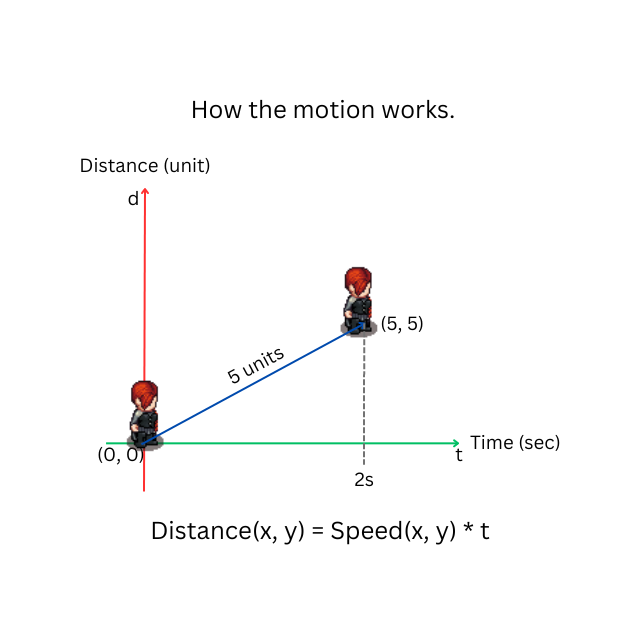

# Zed Mart Zombiefest
**Pubished By:** Ruangyot Nanchiang

## About This Game

[Demo Gameplay Video](https://www.youtube.com/watch?v=Pv-VP99ITcY)

This game is just a stupid 2D game that made by Rust Bevy from scratch.

The goal of this game is just to collect all items in the supermarket before facing the threat of ZEDDD!!!

However, the progress is proving to be quite challenging because this is my first attempt at creating a game from scratch. I'm grappling with numerous mathematics and physics aspects.

So far so good, Let's me present about mathematics and physics that used in this game step by step.

### Motion
When we were young, we must have studied classical physics, which describes how the motion of objects works.

Imagine needing to walk from your house to the office. Would it be possible if you didn't have a speed, and the world didn't have time?

Exactly, isn't it? When you need to go from point A to point B, you have to walk, and as you walk, it takes time. With time in the equation, speed comes into play.

Speed is something that occurs when the distance between the starting point and destination point differs over time.

Then, the equation of motion is going to be demonstrated as shown in the picture below.

### Zombie Head to Player

The direction is simply used to point the zombie towards the player to attack. This utilizes a mathematical technique known as "Vector".

At first, we find the distance between the player and the zombie, normalize the distance to move the zombie slightly based on its speed and direction towards the player. Then, kaboom!

## Tech Stack
- [Rust Bevy](https://bevyengine.org/)

## Assets Credit
- [Universal LPC Spritesheet Generator](https://sanderfrenken.github.io/Universal-LPC-Spritesheet-Character-Generator/#?body=Body_color_light&head=Human_male_light)
- [RPG Map Editor 2](https://deepnight.net/tools/rpg-map/)
- [Food Asset](https://alifdoll.itch.io/pixel-food-asset)
- [Background Music](https://astroghix.itch.io/horror-music-pack)
- [Dead Sound](https://pixabay.com/sound-effects/search/zombie/)

## Is Game Have Finished ?
First version has been finished!!!, But I'd need to add multiplayer mode in the future.